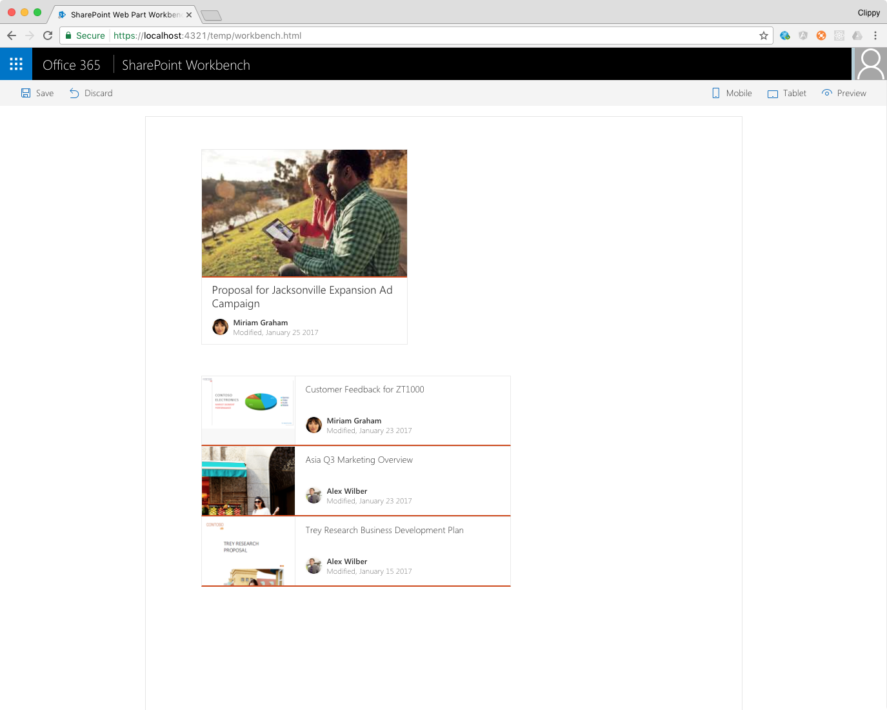

# Building shared code using SharePoint Framework libraries - SharePoint Framework sample

Sample solution illustrating building shared code using SharePoint Framework libraries. The solution consists of two client-side web parts that use a shared service to show information about recently modified documents.

## Minimal path to awesome

- clone this repo
- in the command line:
  - change the directory to **react-recentdocuments-service**
    - `npm i` to restore dependencies
    - (optional) if you want to see document previews on cards, in the **./src/services/documentsService/DocumentsService.ts** file, change the URLs of documents and document images to sample URLs from your tenant
    - `gulp bundle` to build the project
    - `npm link` to register the service project locally as a package with npm
  - change the directory to **react-recentdocuments**
    - `npm link react-recentdocuments-service` to link the local service package
    - `npm i` to restore project dependencies
    - `gulp serve` to build the project and start the workbench

## Features

This sample solution is built on the SharePoint Framework GA release and illustrates building shared code using SharePoint Framework libraries.

This solutions illustrates the following concepts on top of the SharePoint Framework:

- building SharePoint Framework libraries
- building SharePoint Framework services
- working with local Node packages
- registering SharePoint Framework services with the page scope
- consuming SharePoint Framework services from multiple client-side web parts
- sharing data between web parts using SharePoint Framework service